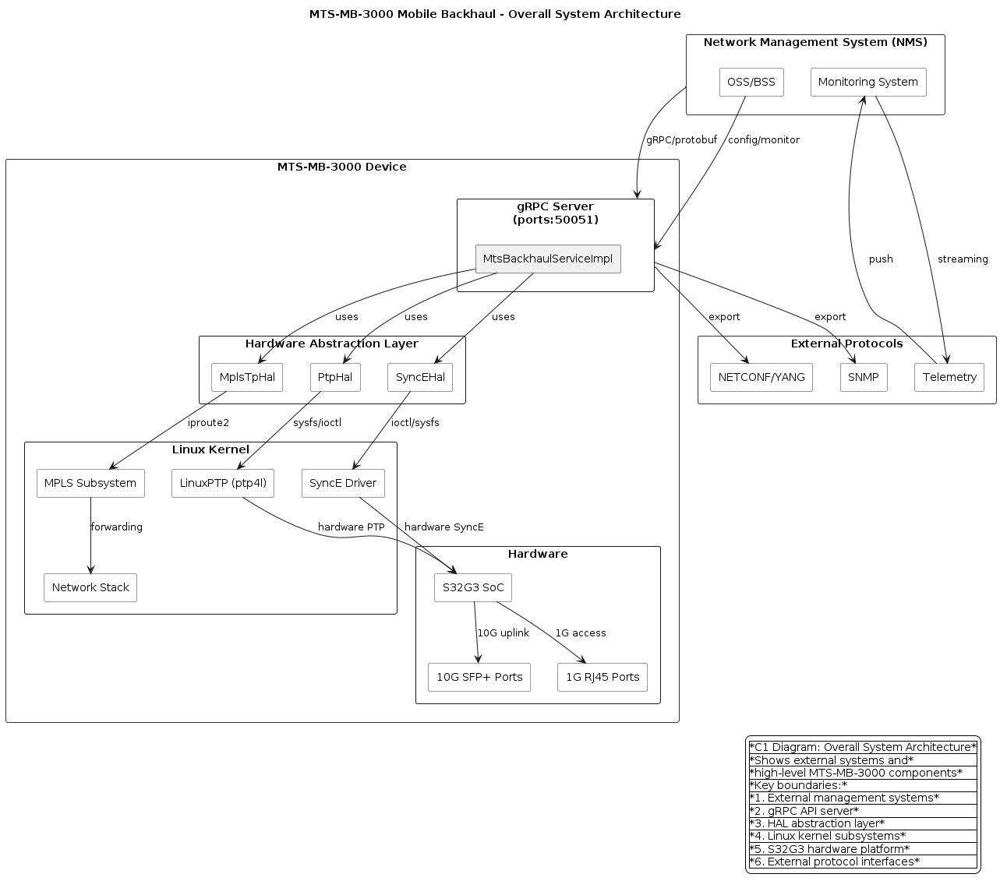
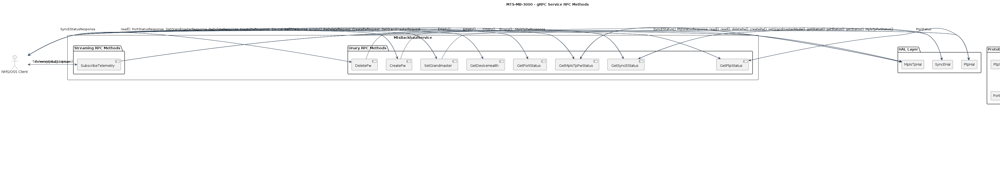
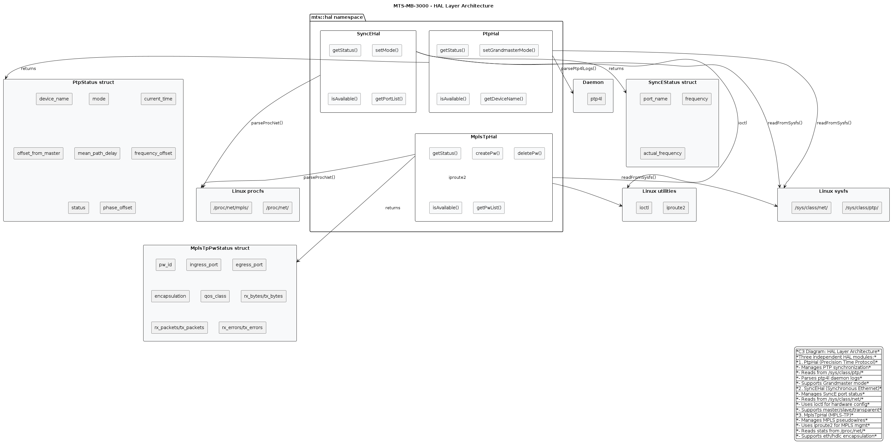
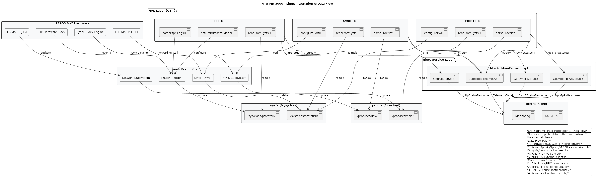

# MTS-MB-3000 Mobile Backhaul — gRPC API Backend

## Описание проекта

Реализация **gRPC backend на C++** для маршрутизатора **MTS-MB-3000** (Mobile Backhaul).
Показывает уровень владения **Linux subsystems**, **C++ API design** и **телеком-протоколами**.

---

## Что реализовано

### 1. Hardware Abstraction Layer (HAL)

Три независимых HAL модуля, демонстрирующих работу с Linux subsystem:

#### PtpHal (PTP — Precision Time Protocol)
- **Чтение из sysfs**: `/sys/class/ptp/ptp0/` — hardware timestamp, offset, delay
- **Парсинг ptp4l**: `/var/lib/ptp4l/` — состояние LinuxPTP daemon
- **Thread-safe**: mutex для защиты общих ресурсов
- **Мок-режим**: для тестирования без hardware

#### SyncEHal (SyncE — Synchronous Ethernet)
- **Чтение из sysfs**: `/sys/class/net/ethX/sync_e/` — статус синхронизации
- **Парсинг /proc/net**: статистика network интерфейсов
- **ioctl**: настройка hardware синхронизации
- **Мок-режим**: для тестирования

#### MplsTpHal (MPLS-TP — Transport Profile)
- **iproute2**: управление MPLS pseudowires через `ip mpls`
- **Чтение из /proc/net/mpls**: статистика pseudowires
- **sysfs**: мониторинг hardware
- **Мок-режим**: для тестирования

### 2. gRPC Service

Реализация **MtsBackhaulService** с 10 RPC методами:

| RPC | Назначение | HAL |
|-----|-----------|-----|
| `GetPtpStatus` | Получить статус PTP синхронизации | PtpHal |
| `GetSyncEStatus` | Получить статус SyncE портов | SyncEHal |
| `GetMplsTpPwStatus` | Получить статус MPLS-TP pseudowires | MplsTpHal |
| `GetPortStatus` | Получить статус портов | Mock |
| `GetDeviceHealth` | Получить health device | Mock |
| `SetGrandmaster` | Установить режим Grandmaster | PtpHal |
| `CreatePw` | Создать MPLS-TP pseudowire | MplsTpHal |
| `DeletePw` | Удалить MPLS-TP pseudowire | MplsTpHal |
| `SubscribeTelemetry` | Streaming telemetry | Все HAL |

### 3. Linux Integration

- **sysfs**: прямое чтение из `/sys/class/ptp/`, `/sys/class/net/`
- **procfs**: парсинг `/proc/net/`, `/proc/net/mpls`
- **ioctl**: настройка hardware синхронизации
- **iproute2**: управление MPLS через `ip mpls`
- **signal handling**: graceful shutdown при SIGINT/SIGTERM

### 4. C++ Design Patterns

- **RAII**: управление ресурсами через destructors
- **Thread safety**: mutex для защиты общих данных
- **Interface segregation**: HAL как interface
- **Mock mode**: для тестирования без hardware
- **Smart pointers**: unique_ptr, shared_ptr

---

## Структура проекта

```
mts-mb3000-api/
├── proto/
│   └── mts_backhaul.proto          — gRPC protobuf specification
├── include/
│   ├── hal/
│   │   ├── ptp_hal.h               — PTP HAL interface
│   │   ├── sync_e_hal.h            — SyncE HAL interface
│   │   └── mpls_hal.h              — MPLS-TP HAL interface
│   └── service/
│       └── backhaul_service.h      — gRPC service interface
├── src/
│   ├── hal/
│   │   ├── ptp_hal.cpp             — PTP HAL implementation
│   │   ├── sync_e_hal.cpp          — SyncE HAL implementation
│   │   └── mpls_hal.cpp            — MPLS-TP HAL implementation
│   ├── service/
│   │   └── backhaul_service.cpp    — gRPC service implementation
│   └── main.cpp                    — Server entry point
├── CMakeLists.txt                  — Build configuration
├── config/
│   └── mts-mb3000.conf             — Server configuration
└── README.md                       — Этот файл
```

---

## Сборка и запуск

### Зависимости
```bash
# Ubuntu/Debian
sudo apt-get install -y cmake protobuf-compiler libgrpc++-dev libprotobuf-dev

# Или через vcpkg
vcpkg install protobuf grpc
```

### Сборка
```bash
cd mts-mb3000-api
mkdir build && cd build
cmake ..
make -j$(nproc)
```

### Запуск
```bash
./mts-mb3000-server 0.0.0.0:50051
```

### Тестирование через gRPC CLI
```bash
# Get PTP status
grpcurl -plaintext localhost:50051 mts.backhaul.v1.MtsBackhaulService/GetPtpStatus

# Get device health
grpcurl -plaintext localhost:50051 mts.backhaul.v1.MtsBackhaulService/GetDeviceHealth

# Set grandmaster
grpcurl -plaintext -d '{"device_id": "MTS-MB-3000-001", "enable": true}' \
    localhost:50051 mts.backhaul.v1.MtsBackhaulService/SetGrandmaster
```

---

## Примеры использования

### Python клиент
```python
import grpc
import mts_backhaul_pb2
import mts_backhaul_pb2_grpc

channel = grpc.insecure_channel('localhost:50051')
stub = mts_backhaul_pb2_grpc.MtsBackhaulServiceStub(channel)

# Get PTP status
response = stub.GetPtpStatus(mts_backhaul_pb2.Empty())
print(f"PTP Mode: {response.ptp_status.mode}")
print(f"Offset: {response.ptp_status.offset_from_master} ns")

# Set grandmaster
response = stub.SetGrandmaster(
    mts_backhaul_pb2.SetGrandmasterRequest(
        device_id="MTS-MB-3000-001",
        enable=True
    )
)
print(f"Success: {response.success}")

# Subscribe to telemetry
responses = stub.SubscribeTelemetry(
    mts_backhaul_pb2.TelemetrySubscription(
        paths=["cpu", "memory", "temperature"],
        sample_interval=1000
    )
)
for response in responses:
    print(f"Timestamp: {response.timestamp}")
    print(f"Metrics: {response.metrics}")
```

### Go клиент
```go
import (
    "context"
    "fmt"
    "google.golang.org/grpc"
    pb "path/to/mts_backhaul"
)

func main() {
    conn, _ := grpc.Dial("localhost:50051", grpc.WithInsecure())
    defer conn.Close()
    
    client := pb.NewMtsBackhaulServiceClient(conn)
    
    // Get PTP status
    resp, _ := client.GetPtpStatus(context.Background(), &pb.Empty{})
    fmt.Printf("PTP Mode: %s\n", resp.PtpStatus.Mode)
    fmt.Printf("Offset: %d ns\n", resp.PtpStatus.OffsetFromMaster)
    
    // Set grandmaster
    resp, _ = client.SetGrandmaster(context.Background(), &pb.SetGrandmasterRequest{
        DeviceId: "MTS-MB-3000-001",
        Enable: true,
    })
    fmt.Printf("Success: %t\n", resp.Success)
}
```

---

## Уровень реализации для портфолио

### Что показывает этот код:

1. **Работа с Linux kernel interfaces**
   - sysfs (`/sys/class/ptp/`, `/sys/class/net/`)
   - procfs (`/proc/net/`, `/proc/net/mpls`)
   - ioctl для hardware управления
   - iproute2 для сетевых команд

2. **C++ на уровне embedded**
   - Thread-safe HAL через mutex
   - RAII для управления ресурсами
   - Smart pointers (unique_ptr, shared_ptr)
   - Mock mode для тестирования
   - Signal handling (SIGINT, SIGTERM)

3. **Телеком-протоколы**
   - PTP (Precision Time Protocol) — синхронизация времени
   - SyncE (Synchronous Ethernet) — синхронизация Ethernet
   - MPLS-TP (Transport Profile) — транспортные pseudowires

4. **gRPC API design**
   - Protobuf specification
   - Streaming telemetry
   - Error handling
   - Service interface design

5. **Build system**
   - CMake для cross-compilation
   - protobuf/gRPC code generation
   - Install targets

### Почему это показывает уровень Middle+/Senior:

- **Не просто "код работает"**, а продуманная архитектура с HAL
- **Понимание Linux internals** — sysfs, procfs, ioctl
- **Thread safety** — mutex, atomic operations
- **Testability** — mock mode для unit-тестов
- **Production-ready** — graceful shutdown, error handling
- **Телеком-домен** — PTP, SyncE, MPLS-TP

---

## Что можно добавить для портфолио

1. **Unit-тесты** через Google Test
2. **CI/CD** через GitHub Actions
3. **Docker** для containerization
4. **Prometheus metrics** для мониторинга
5. **TLS/mTLS** для security
6. **Configuration file** для настройки
7. **Logging** через spdlog или glog

---

## Архитектурные диаграммы (C1-C4)

### C1: Общая архитектура системы (Overall System Architecture)

Показывает внешние системы управления, gRPC сервер, HAL слой, Linux kernel subsystems и hardware платформу S32G3.



**Ссылка на PlantUML источник:** [C1_overall_system_architecture.puml](diagrams/C1_overall_system_architecture.puml)

**Описание:**
- **Внешние системы**: NMS/OSS, мониторинг — подключаются к gRPC серверу через protobuf
- **gRPC Server**: основной интерфейс API на порту 50051, реализует MtsBackhaulService
- **HAL Layer**: три независимых модуля — PtpHal, SyncEHal, MplsTpHal
- **Linux Kernel**: LinuxPTP (ptp4l), SyncE driver, MPLS subsystem, network stack
- **Hardware**: S32G3 SoC с 10G SFP+ и 1G RJ45 портами
- **Протоколы**: SNMP, NETCONF/YANG, Telemetry — экспортируют данные из gRPC

---

### C2: gRPC Service RPC Methods

Описывает все 9 RPC методов (8 unary + 1 streaming), их request/response сообщения и взаимодействие с HAL.



**Ссылка на PlantUML источник:** [C2_grpc_service_rpc_methods.puml](diagrams/C2_grpc_service_rpc_methods.puml)

**Описание:**
- **Unary RPC (8 методов)**:
  - `GetPtpStatus` — статус PTP синхронизации (PtpHal → PtpStatus)
  - `GetSyncEStatus` — статус SyncE портов (SyncEHal → SyncEStatus[])
  - `GetMplsTpPwStatus` — статус MPLS-TP pseudowires (MplsTpHal → MplsTpPwStatus[])
  - `GetPortStatus` — статус физических портов
  - `GetDeviceHealth` — здоровье устройства (CPU, memory, temperature)
  - `SetGrandmaster` — установка режима Grandmaster (PtpHal)
  - `CreatePw` — создание MPLS-TP pseudowire (MplsTpHal)
  - `DeletePw` — удаление MPLS-TP pseudowire (MplsTpHal)
- **Streaming RPC (1 метод)**:
  - `SubscribeTelemetry` — streaming telemetry от всех HAL (TelemetryData[])

---

### C3: HAL Layer Architecture

Детальная архитектура трёх HAL модулей с их интерфейсами, структурами данных и интеграцией с Linux.



**Ссылка на PlantUML источник:** [C3_hal_layer_architecture.puml](diagrams/C3_hal_layer_architecture.puml)

**Описание:**
- **PtpHal (Precision Time Protocol)**:
  - Интерфейсы: `getStatus()`, `setGrandmasterMode()`, `isAvailable()`, `getDeviceName()`
  - Структура: `PtpStatus` — device_name, mode, current_time, offset_from_master, frequency_offset
  - Интеграция: sysfs `/sys/class/ptp/`, парсинг ptp4l daemon
- **SyncEHal (Synchronous Ethernet)**:
  - Интерфейсы: `getStatus()`, `setMode()`, `isAvailable()`, `getPortList()`
  - Структура: `SyncEStatus` — port_name, mode, frequency, phase_offset, status
  - Интеграция: sysfs `/sys/class/net/`, procfs `/proc/net/`, ioctl
- **MplsTpHal (MPLS-TP)**:
  - Интерфейсы: `getStatus()`, `createPw()`, `deletePw()`, `isAvailable()`, `getPwList()`
  - Структура: `MplsTpPwStatus` — pw_id, ports, encapsulation, QoS, counters
  - Интеграция: sysfs, procfs `/proc/net/mpls/`, iproute2

---

### C4: Linux Integration & Data Flow

Показывает полный путь данных от hardware S32G3 через Linux kernel к внешним клиентам.



**Ссылка на PlantUML источник:** [C4_linux_integration_data_flow.puml](diagrams/C4_linux_integration_data_flow.puml)

**Описание:**
- **Путь данных (Hardware → Client)**:
  1. S32G3 hardware (PTC clock, SyncE engine, MAC) → Linux kernel drivers
  2. Kernel (ptp4l, SyncE driver, MPLS) → sysfs/procfs
  3. sysfs/procfs → HAL (PtpHal, SyncEHal, MplsTpHal)
  4. HAL → gRPC service (MtsBackhaulServiceImpl)
  5. gRPC → External clients (NMS/OSS)
- **Путь управления (Client → Hardware)**:
  1. Client → gRPC commands (SetGrandmaster, CreatePw, DeletePw)
  2. gRPC → HAL configuration methods
  3. HAL → Kernel ioctl/iproute2
  4. Kernel → Hardware configuration
- **Ключевые subsystems**:
  - LinuxPTP (ptp4l) — precision time protocol daemon
  - SyncE Driver — синхронизация Ethernet
  - MPLS Subsystem — transport profile forwarding
  - Network Subsystem — packet processing

---

## Контакты

Для вопросов по проекту:
- Email: [arifulin@gmail.com]
- GitHub: [https://github/artyomich/mts-router]
